# Toolzer

Toolzer is a compact visual toolkit for Obsidian.

I built it for myself because I wanted a faster way to tune the reading and writing feel of the app without digging through themes, CSS snippets, and scattered settings every time. After it became genuinely useful in daily use, I decided to clean it up and share it.

It is not trying to be a huge framework or a total Obsidian redesign. It is a practical control layer for comfort, readability, and small workflow tweaks.

## What It Does

Toolzer gives you a single popup with controls for:

- text width
- body and UI fonts
- line, paragraph, and letter spacing
- text size
- selection highlight color
- reusable highlight markers
- heading decoration styles
- custom bullet symbols and emoji insert tools
- image and task styling
- paper-like note backgrounds
- theme switching
- saved presets / workspace loadouts
- reading helpers like smooth scroll, progress bar, ruler, and columns

## What You Will Find Inside

The plugin is especially focused on the small things that change how Obsidian feels during long sessions:

- making notes narrower and calmer to read
- switching between different visual moods fast
- giving text a paper, notebook, grid, or dotted texture
- saving favorite setups as presets instead of rebuilding them manually
- adding quick visual tools that are useful in actual writing and reading, not just in demos

## Why I Made It

Most of these controls existed somewhere in Obsidian already, or could be hacked together through themes and snippets.

The problem was friction.

Toolzer is my attempt to make those adjustments feel immediate, local, and pleasant enough that you actually use them.

I did not make it as a startup product or as some grand productivity system. I made it because I spend a lot of time inside Obsidian, and I wanted the app to feel more comfortable, more flexible, and a little more mine.

That is also the general logic behind most things I build: I usually make small tools for myself first, then share them if they turn out genuinely useful for other people too.

## Screenshots

### Overview

Toolzer lives in a single compact popup that stays close to the note instead of sending you through multiple settings screens.

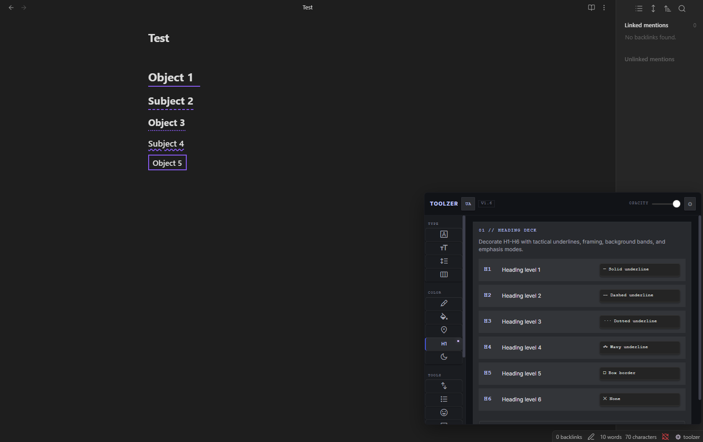

### Reading And Layout

This is the core of the plugin: making long writing and reading sessions easier on the eyes.

- `Width Instrument` narrows wide notes into a more comfortable reading column.
- `Spacing Engine` adjusts line, paragraph, and letter spacing without touching your theme files.
- `Font Engine` lets you swap body and UI fonts fast.
- `Reader Module` adds a progress bar and a reading ruler for focus.

  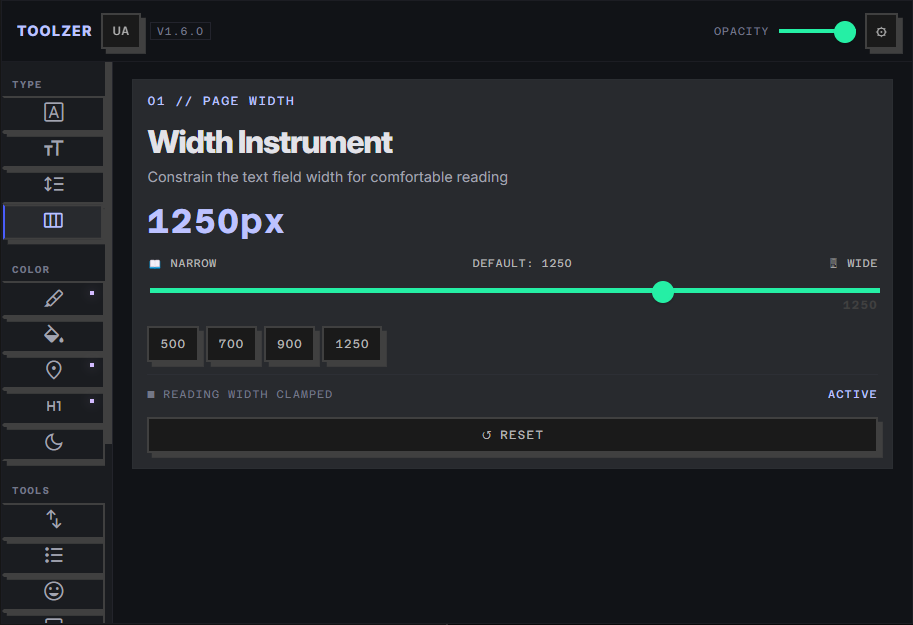
  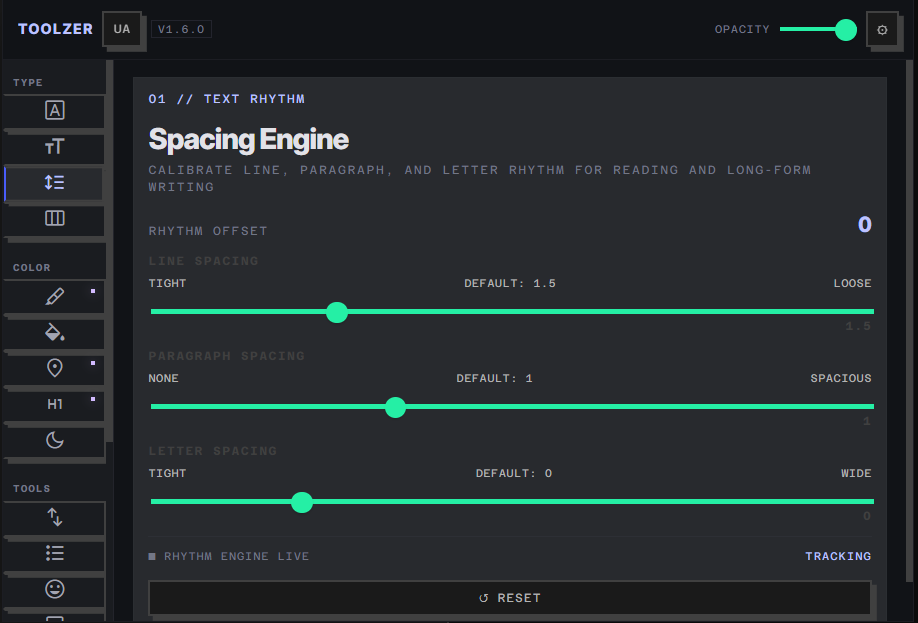

  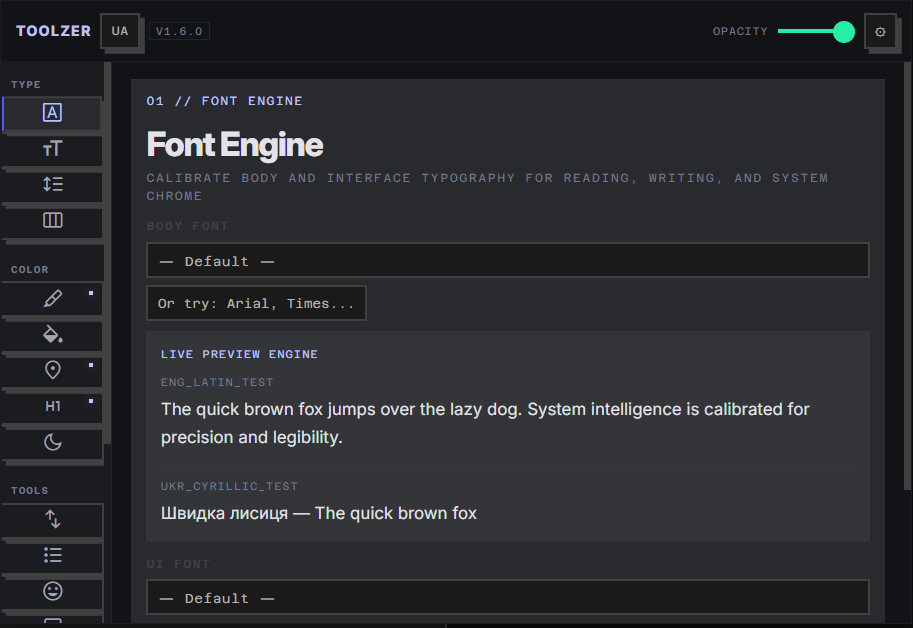
  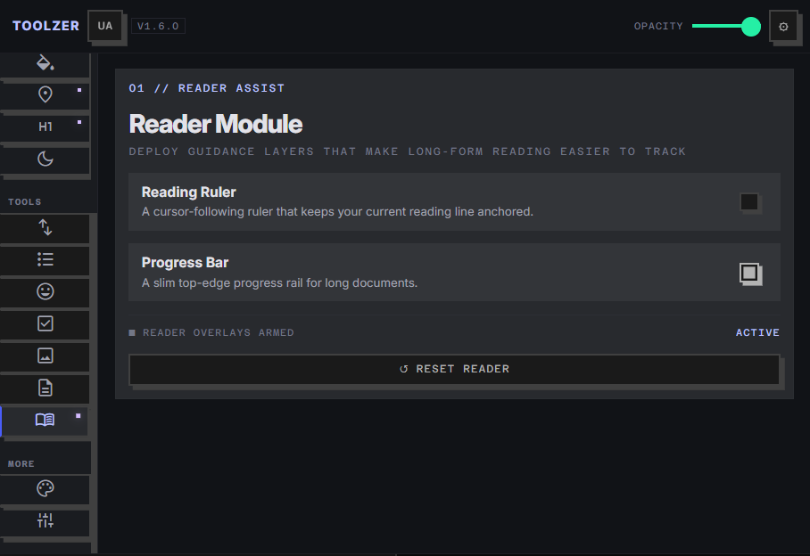

### Highlights And Paper

Toolzer also gives you fast visual controls that change how notes feel without turning them into a CSS project.

- `Highlight Engine` changes the native text selection color.
- `Markers` let you save reusable highlight colors and apply them to selected text.
- `Paper Engine` adds lined, grid, dotted, and notebook-style textures behind the note.

  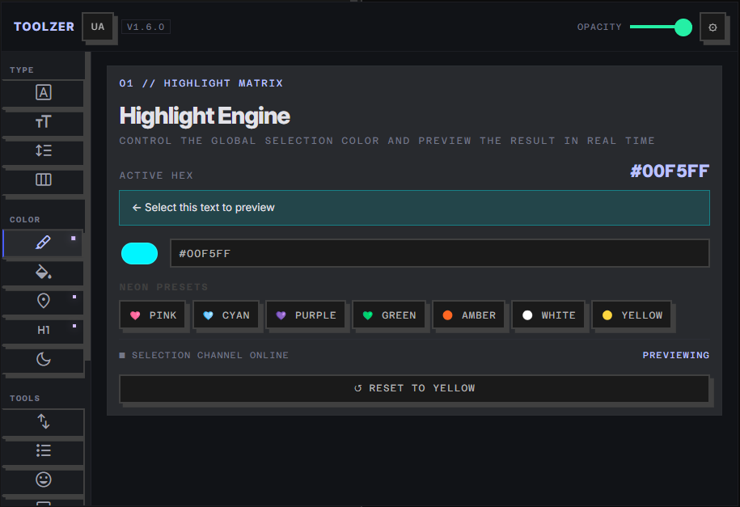
  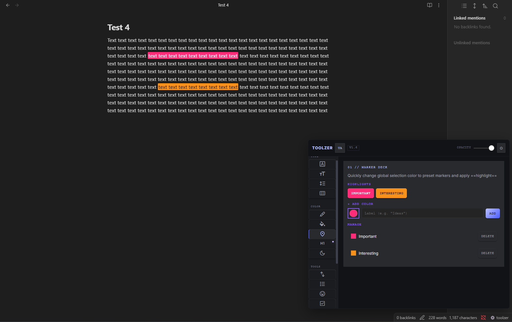

  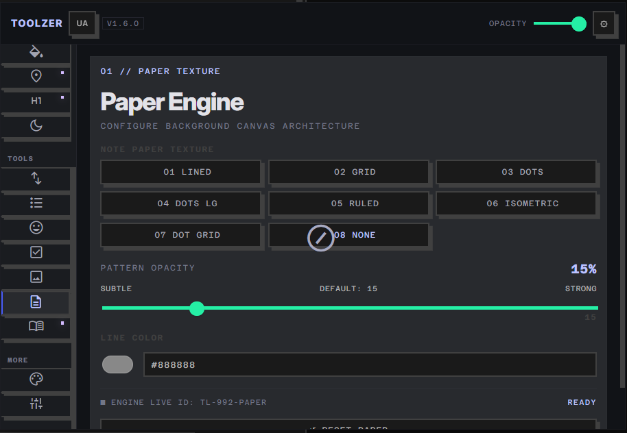
  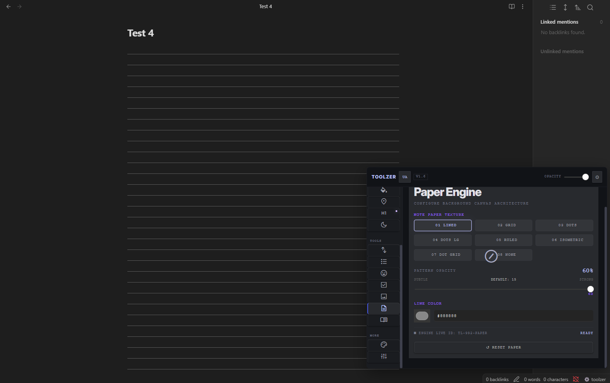

  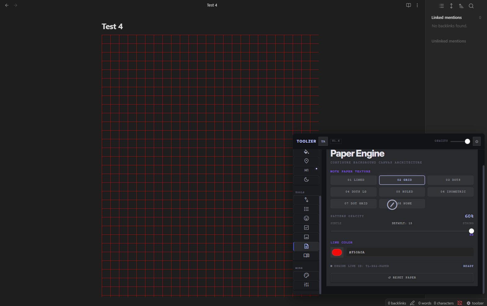

### Themes, Presets, And Quick Switching

Some days you want a clean writing setup. Some days you want something denser, darker, or more playful. Toolzer makes those switches quick.

- `Theme Switcher` swaps between installed Obsidian themes.
- `Workspace Loadouts` saves your current Toolzer setup as a preset so you can come back to it later.

  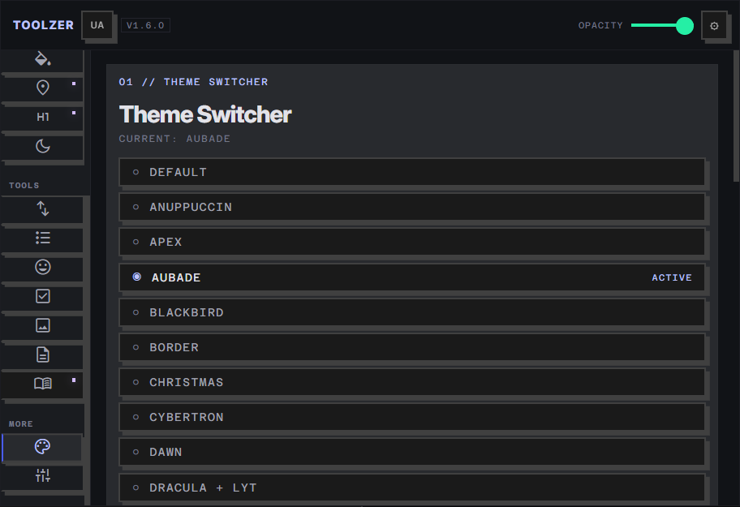
  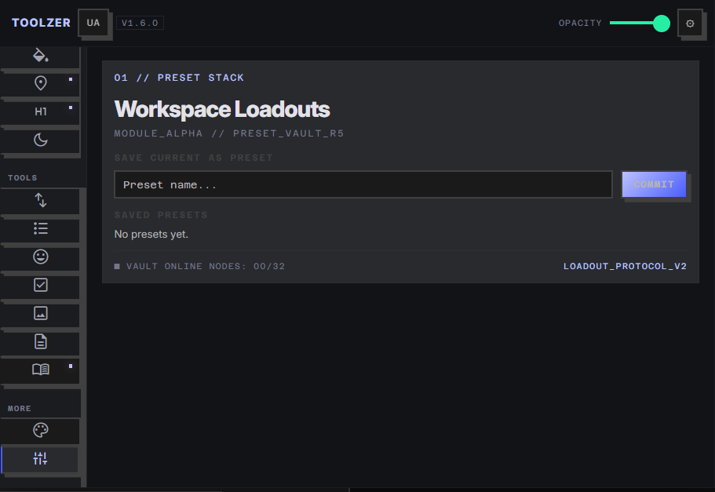

### Other Small Tools

There are also smaller utilities inside the popup for:

- scroll tuning
- bullet styling
- emoji insertion
- heading decoration
- image treatment
- task styling
- text color and night / sepia adjustments

They are there for the same reason as everything else in Toolzer: quick local control without digging through scattered settings.

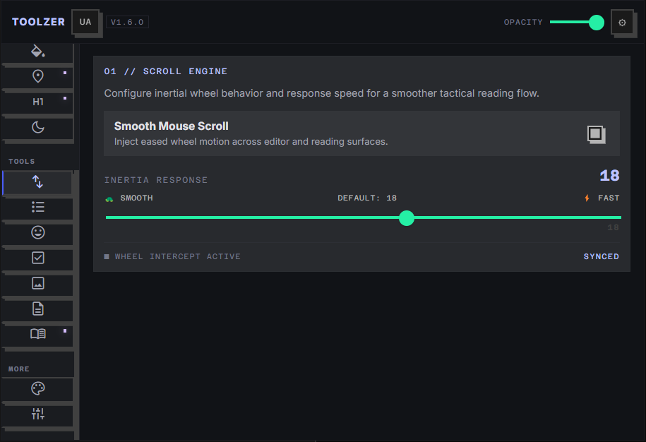

## Install

Right now Toolzer is set up as a manual install plugin.

1. Download the release files.
2. Create a folder named `toolzer` inside your vault at `.obsidian/plugins/`.
3. Put `manifest.json` and `main.js` into that folder.
4. Reload Obsidian and enable `Toolzer` in Community Plugins.

## Current Status

Currently shipping: `Toolzer`

Building next: `Screen Translator`

## Support

If Toolzer ended up useful for you and you want to support more small tools like this, you can leave a donation here:

[Support Toolzer via PayPal](https://www.paypal.com/donate/?hosted_button_id=Z39L48YFQ7G8J)

## Notes

- Tested as a practical personal-use plugin first, then cleaned up for release.
- Some features depend on your installed fonts, active theme, and current Obsidian setup.
- The plugin is meant to stay lightweight and useful, not turn into an overbuilt platform.
